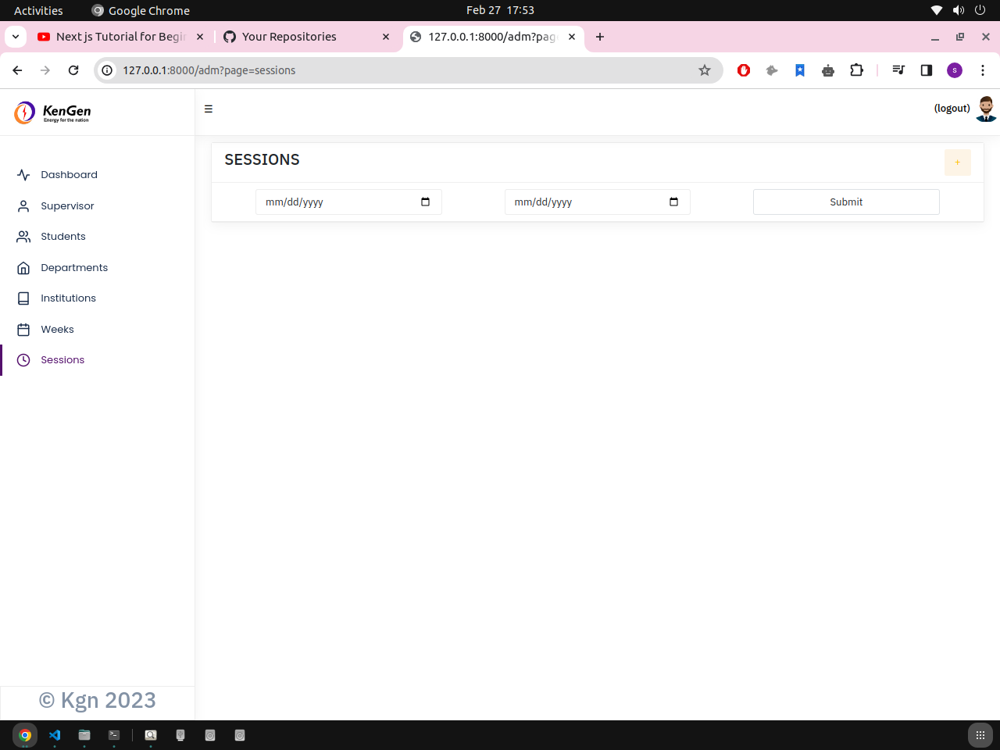

# GUIDES ON HOW TO RUN THE APP

This app helps the organization keep track of the activities undertaken by students during field attachments
> # SECTION 1: SETTING UP


## Clone The Project
```bash
    git clone https://github.com/arthurom254/KengenAttachmentPortal.git
```


## CREATE A VIRTUAL ENVIRONMENT

- Windows
    ``` bash
    py -m venv venv

    ```
- Linux 
    ``` bash
    python3 -m manage runserver
    ```

## ACTIVATE THE VIRTUAL MACHINE
- Windows
    ``` bash
    ./venv/Scripts/activate
    ```
- Linux
    ```
    source venv/bin/activate
    ```
## INSTALL THE REQUIREMENTS
``` bash
pip install -r requirements.txt
```

## NAVIGATE TO THE PROJECT FOLDER
``` bash
cd KengenAttachmentPortal
```

## CREATE SUPERUSER
- Windows
    ```
    python3 -m manage createsuperuser
    ```
- Linux
    ```
    py -m manage createsuperuser
    ```
-----------
> # SECTION 2: RUN SERVER
-----------

- Windows
    ``` bash
    py -m manage runserver
    ```
- Linux
    ``` bash
    python3 -m manage runserver
    ```

> IF YOU ARE HERE THEN THAT MEANS EVERYTHING IS WORKING WELL. CLAP FOR YOURSELF HAHA

> Open the app by visiting [http://127.0.0.1:8000](http://127.0.0.1:8000)

> You can find the admin (superuser page [here](http://127.0.0.1:8000/admin))

> # SECTION 3: HOW IT WORKS
- Login as an admin using the username and password created [here](#create-superuser) or use 
``` bash
username: admin
password: admin
```
- Navigate to the Session (start date - end date of attachment) to add a new session then check the radio button to make it active. The weeks will be automatically generated for you.



- Now add the Institutions followed by the Departments then Students and Supervisors
- Students will receive an email containing their username and password, They can change their password before login by visiting the forgot password page
> # SECTION 4: WHAT NEXT
- Try to fix the file upload vulnarability in the student's side. Might lead to server reverse shell connection

